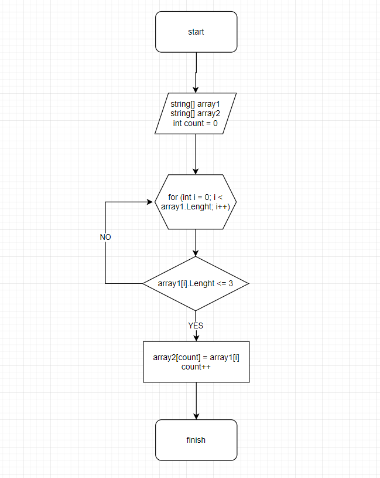

# Задача:

Написать программу, которая из имеющегося массива строк формирует новый массив из строк, длина которых меньше, либо равна 3 символам. Первоначальный массив можно ввести с клавиатуры, либо задать на старте выполнения алгоритма. При решении не рекомендуется пользоваться коллекциями, лучше обойтись исключительно массивами.

# Решение

1. Создали массив с элементами, затем еще массив, в котором указываем длинну предыдущего массива;

2. Пишем цикл, проходящий по длинне масиива;

3. В цикле пишем условие, чтоб длинна была меньше или равна 3;

4. Если условие соблюдается, элемент массива записываем в массив;

5. Печатаем Write;

6. При выполнении условия, счетчик учеличиваем на 1;

Присутствует алгоритм выполнения 